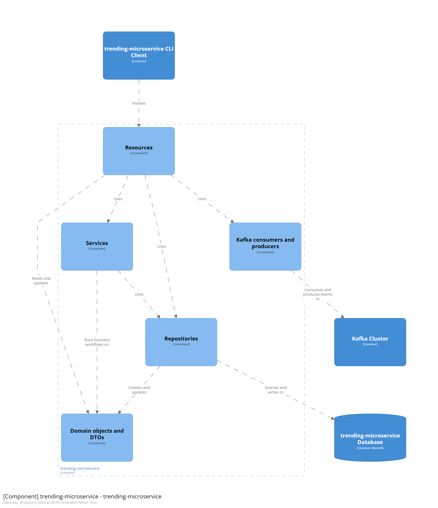

# Micronaut microservices + clients
 - Video microservice
 - Trending hashtags microservice
 - Subscription Microservice

This project contains an the code for the three microservices and the modeling required for the assessment.
This repo was made using the template provided.


## Endpoints

Each microservice has RESTful endpoints for both lists and items.  
For a list of the endpoints for video, consult the [`VideosClient`](microservices\client\video-cli\src\main\java\uk\ac\york\eng2\videos\cli/VideosClient.java) and [`UsersClient`](microservices\client\video-cli\src\main\java\uk\ac\york\eng2\videos\cli/UsersClient.java) declarative HTTP client.  
For a list of the endpoints for trending, consult the [`TrendingClient`](microservices\client\trending-cli\src\main\java\uk\ac\york\eng2\cli/TrendingClient.java) declarative HTTP client.

## Development/Running separately deployable with Eclipse

To work on this project from Eclipse 4.9 and onwards, make sure you have [Eclipse Buildship](https://www.vogella.com/tutorials/EclipseGradle/article.html) installed, and that you are using [Java 11](https://adoptium.net/) or later.

Clone the project, and run this command to generate the relevant Eclipse-specific projects:

```sh
cd /microservices
./eclipse.sh
```

Use Eclipse to import the projects, selecting `File - Import... - Gradle - Existing Gradle Project`.
Import `video-cli`, `trending-cli` ,`video-microservice`, `trending-microservice` separately: the order does not matter.

### Starting the docker container
```sh
cd /microservices
docker compose up -d
```

#### For video-microservice, other microservices same but with name replaced 
To run the microservice, use the `Gradle Tasks` view to start the `run` task of the `video-microservice` project.

To run the CLI tool, the most convenient option for development is to use the `run` task as well, but from a console:

```sh
cd /microservices/client/video-cli
./gradlew run --args='--help'
```

to add a video (for example) use 
```sh
./gradlew run --args='add-video Vid1 User1 Hashtag1,Hashtag2'
```
the use this command to get the videos
```sh
./gradlew run --args='get-videos'
```

## Integration testing with Docker Compose

To run the microservice running on its own Docker image, run these commands from the microservices folder:

```sh
cd /video-microservice
./gradlew dockerBuild
cd ..
cd /trending-microservice
./gradlew dockerBuild
cd ..
cd /trending-microservice
./gradlew dockerBuild
cd ..
docker compose -p microservices-prod -f compose-prod.yml up -d
```

This will build a Java-based Docker image of the microservice, and then start it together with its dependencies.

This can then be used the test the system as a whole and see (for example) if when videos are posted with hashtags, they appear in the trending microservice.

## Viewing and editing the C4 model

The above C4 model was created using the textual [Structurizr DSL](https://docs.structurizr.com/dsl/).

The Compose file includes a container that runs the [Structurizr Lite](https://structurizr.com/help/lite) Docker image, which will automatically visualise the contents of the [`structurizr/workspace.dsl`](structurizr/workspace.dsl) file.
After running the compose script (not prod), Structurizr Lite is available from this URL:

http://localhost:8081/

To experiment with the Structurizr DSL, edit the `workspace.dsl` with your preferred text editor, and reload the page.

## C4 container models

The system can be described through the following [C4 container model](https://c4model.com/):

## Video Microservice

## Trending Microservice

## Subscription Microservice

